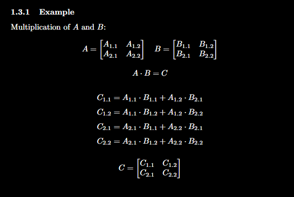

# Matrix Operations

<p align="center">
    <a href="https://github.com/ahmedcali84/matrix/tree/main/lib">
        
    </a>
</p>


> [!WARNING]
> **This library is a work in progress. Features may change, and there may be bugs. Your feedback is welcome!**

This repository contains a collection of matrix operations implemented in C. The project demonstrates fundamental matrix operations such as addition, subtraction, multiplication, and transposition. Matrix operations are essential in various fields, including computer graphics, physics simulations, and machine learning.

## Table of Contents

- [Matrix Operations](#matrix-operations)
  - [Table of Contents](#table-of-contents)
  - [Usage](#usage)
  - [License](#license)
  - [Contact](#contact)
  - [Contribution](#contribution)

## Usage

The program performs various matrix operations.

1. **Compile the Program**:
    ```bash
    make
    ```

2. **Run the Program to test the test_cases**:
    ```bash
    ./gen
    ```

## License

This project is licensed under the MIT License - see the [LICENSE](LICENSE) file for details.

## Contact

If you have any questions or feedback, feel free to contact me at [ahmedcali1984@gmail.com](mailto:ahmedcali1984@gmail.com) or via [LinkedIn](https://www.linkedin.com/in/ahmed-ali-99055728b/).

## Contribution

Contributions are welcome! Please feel free to submit a pull request or open an issue if you have suggestions or improvements.
